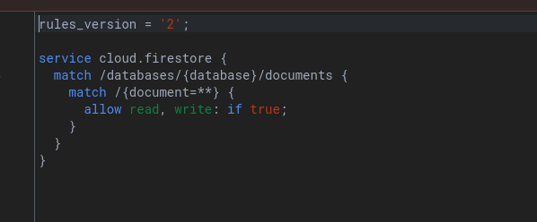

# Market Place Product Management

A simple React application that allows users to manage a marketplace of products using Firebase Firestore as the backend. Users can add, update, and delete products dynamically, with changes reflected in the database.

## Features

- **Add Products**: Add a new product with a name and price.
- **Update Products**: Edit the details of an existing product.
- **Delete Products**: Remove a product from the marketplace.
- **Real-Time Updates**: Reflect changes dynamically using Firebase Firestore.

## Technologies Used

- **Frontend**: React.js, Tailwind CSS
- **Backend**: Firebase Firestore
- **Deployment**: Any hosting platform supporting React apps (e.g., Firebase Hosting, Vercel, Netlify)

---

## Getting Started

### Prerequisites

Make sure you have the following installed:

- [Node.js](https://nodejs.org/) (v14 or later)
- [Firebase Account](https://firebase.google.com/) with a Firestore database setup

---

### Installation

1. Clone the repository:

   ```bash
   git clone https://github.com/ezekielkibiego/market-place
   cd market-place
2. Install dependencies:

    ```bash
    npm install

3. Set up Firebase

    - **Create a Firebase project** in the [Firebase Console](https://console.firebase.google.com/).
    - **Enable Firestore** in the **Build > Firestore Database** section.
    - Add your Firebase configuration to a new file `Firebase.js` in the project root:

       ```javascript
       import { initializeApp } from "firebase/app";
       import { getFirestore } from "firebase/firestore";

       const firebaseConfig = {
         apiKey: "YOUR_API_KEY",
         authDomain: "YOUR_AUTH_DOMAIN",
         projectId: "YOUR_PROJECT_ID",
         storageBucket: "YOUR_STORAGE_BUCKET",
         messagingSenderId: "YOUR_MESSAGING_SENDER_ID",
         appId: "YOUR_APP_ID",
       };

       const app = initializeApp(firebaseConfig);
       const db = getFirestore(app);

       export { db };

4. Run the application:
    ```bash
    npm run dev


The app will be available at 
    <a href="http://localhost:5173" target="_blank">http://localhost:5173 </a>


## Firestore Rules

For development, set Firestore rules to allow read and write operations:

  


⚠️ Update the rules for production to secure your database.


## Usage

1. Open the application in your browser.
2. Add products using the input fields and "Add Product" button.
3. Edit or delete products using the respective buttons next to each product.
4. All changes are reflected dynamically in the Firebase Firestore database.

## Contributing

Contributions are welcome! Feel free to submit a pull request or open an issue for suggestions or bug fixes.

## License

This project is licensed under the MIT License. See the LICENSE file for details.

## Acknowledgments
- Firebase for backend services
- React for the frontend framework
- Tailwind CSS for styling

